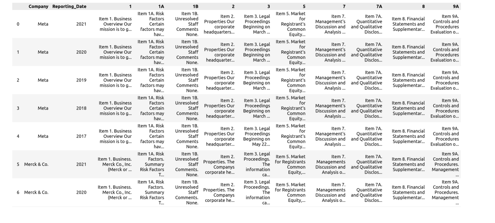

# Financial Dashboard For Annual 10K Reports

A financial dashboard that consolidates all of a business's critical observations in one place using the information obtained from the annual 10K Filings of the companies.
The financial dashboard contains:
- **Insights and summaries** for different sections from annual corporate filings.
-**Sentiment-based score** that measures the company's performance over a certain time period.
- Identification of **important topics** and **frequently occuring** words mentioned in the report. 

The Financial Dashboard for Market Intelligence has been deployed on Streamlit.

The app can be viewed here: [Financial Dashboard](https://vrunm-financial-dashboard-app-05vytr.streamlit.app/)

## **Data**
To extract the text from the SEC filing, the SEC’s ExtractorAPI was used. The API can extract any text section from 10-Q, 10-K, and 8-K SEC filings, and returns the extracted content in cleaned and standardized text or HTML format.
The twelve companies for which the data has been collected as listed below organized by sector:
1. Pharmaceutical:
Abbvie, Pfizer, Merck
2. Technology:
Alphabet, Meta, Microsoft
3. Retail:
Costco
4. Oil and Natural Gas:
Chevron
5. Food and Beverages:
Coca Cola, Pepsico

The can be viewed as
 

## **Sentiment Analysis**
A local cross validation split was created by randomly sampling rows from the records of 12 companies across sectors like Technology, Finance, Retail and Pharma.

<a href="https://github.com/vrunm/Financial_Dashboard/blob/main/meta_10K.pdf" class="image fit" > A sample 10k report for Meta can be viewed here</a>

The RoBERTa, FinBERT and DistilBERT models were fine-tuned for sentiment analysis. The best results were obtained using the fine-tuned **DistilBERT** model. It achieved an Accuracy of 91.11% and an ROC-AUC Score of 0.972.

| Model | Accuracy | F1 | AUC |
| ----- | ------ | -------- | ------------------ | 
| Roberta | 0.662 | 0.656 | 0.628 |
| FinBERT | 0.746 | 0.682 | 0.721 | 
| DistilBERT | 0.911 | 0.914 | 0.972 |

## **Summarization**

For the summarization task, the data of Pfizer, Costco and Meta was labeled and used. A local cross validation split was created by randomly sampling rows from the records of these companies.
Text summarization was carried out using these three transformers models:

The T5, DistilPEGASUS and DistilBART models were fine-tuned for summarization. The best results were obtained using the fine-tuned **DistilBART** model. It achieved an ROUGE-L Score of 67.7%.

| Model | ROUGUE-1 | ROUGUE-2 | ROUGUE-L | ROUGUE-LSUM
| ----- | ------ | -------- | ------------------ | ------------------|
| T5| 32.22 | 28.5 | 31.5| 31.5 | 31.5 |
| DistilPEGASUS | 48.32 | 34.48 |43.51| 31.50 |
| DistilBART | 72.28 | 61.15 | 67.70 | 71 |

## **Identifying Important Keywords**

RAKE NLTK was used to identify important keywords from the generated summaries.

